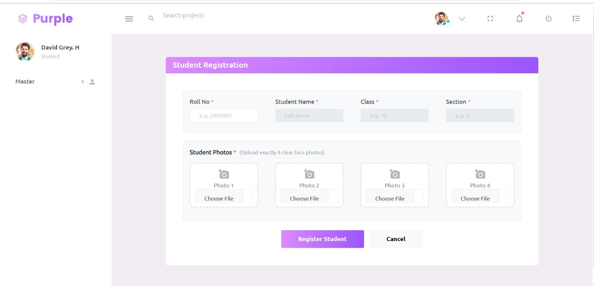
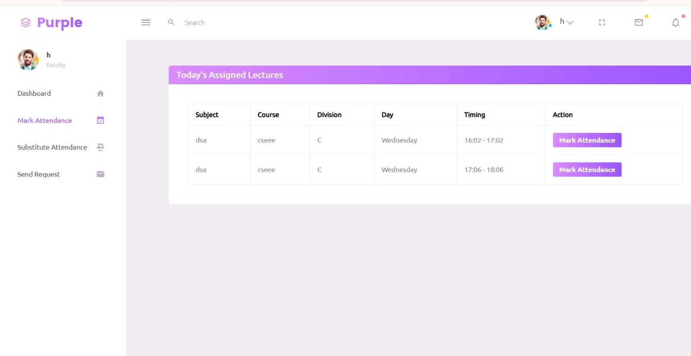
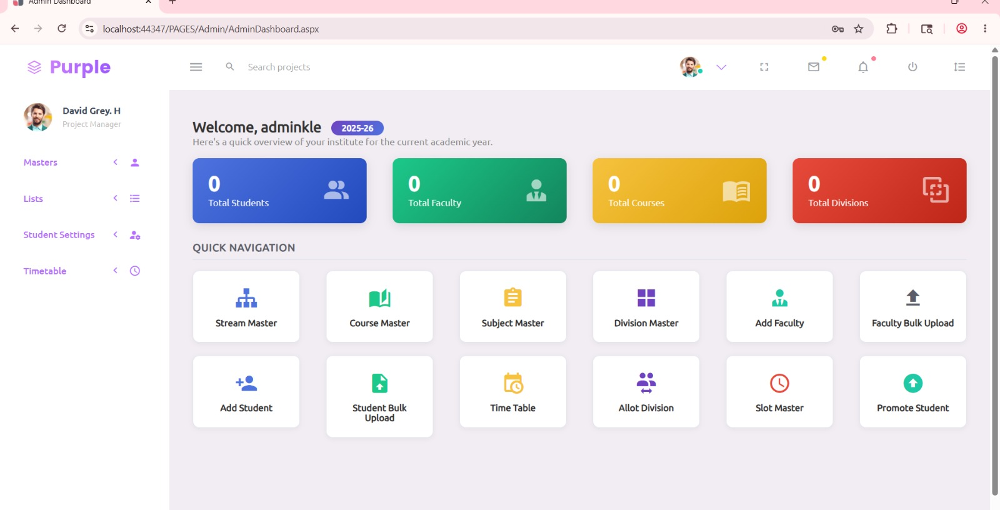
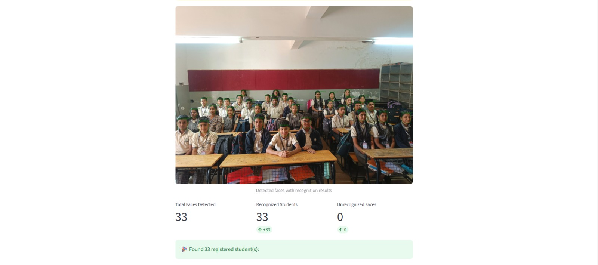
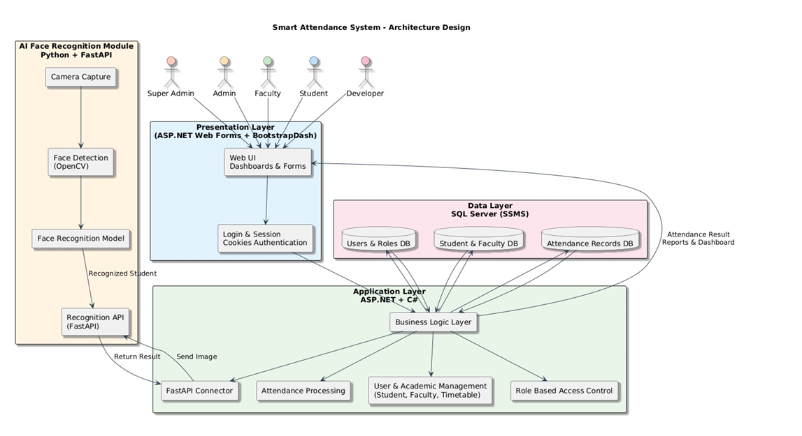

# Smart Attendance System

## Overview

Smart Attendance System is an AI-powered attendance management platform that automates attendance marking using face recognition technology.

The system uses the InsightFace buffalo_l model to identify students from classroom photographs and automatically record attendance.

This project was developed during my internship at AarGees Business Solutions as part of my Bachelor of Engineering in Computer Science and Engineering.

---

## Features

- Face Recognition based Attendance
- Student Registration and Enrollment
- Faculty Dashboard
- Student Dashboard
- Attendance Reports
- Bulk Student Import
- Role-Based Access Control
- Multi-Face Recognition
- Attendance Correction Requests
- CSV Report Generation

---

## Tech Stack

### Frontend
- ASP.NET Web Forms
- HTML5
- CSS3
- JavaScript
- BootstrapDash

### Backend
- C#
- ASP.NET
- Python
- Flask

### Database
- SQL Server
- SQL Server Management Studio (SSMS)

### AI & Machine Learning
- InsightFace (buffalo_l)
- OpenCV
- NumPy

---

## System Architecture

ASP.NET Frontend → Flask AI Service → SQL Server Database

The system follows a layered architecture consisting of:

- Presentation Layer
- Application Layer
- AI Recognition Layer
- Database Layer

---

## Screenshots

### Login Page

### Student Dashboard

### Faculty Dashboard

### Attendance Report

### Result

### Architecture Diagram

---

## Face Recognition Workflow

1. Faculty uploads classroom photographs.
2. Flask service receives the images.
3. InsightFace detects faces.
4. Facial embeddings are generated.
5. Cosine similarity matching is performed.
6. Attendance is automatically marked.
7. Results are stored in SQL Server.

---

## Documentation

The complete project report is available in this repository.

## Internship Details

**Organization:** AarGees Business Solutions

**Duration:** January 2026 – May 2026

**Role:** Software Intern

### Responsibilities

- Developed Smart Attendance System
- Integrated Flask AI service with ASP.NET
- Implemented Face Recognition using InsightFace
- Designed SQL Server database schema
- Built attendance automation workflow

---

## Author

**Rohan S Dasogamath**

Bachelor of Engineering (Computer Science and Engineering)

KLE Technological University, Hubballi

### Connect with Me

- LinkedIn: https://www.linkedin.com/in/rohan-s-dasogamath-8098a0383
- GitHub: https://github.com/rohansdasogamath
